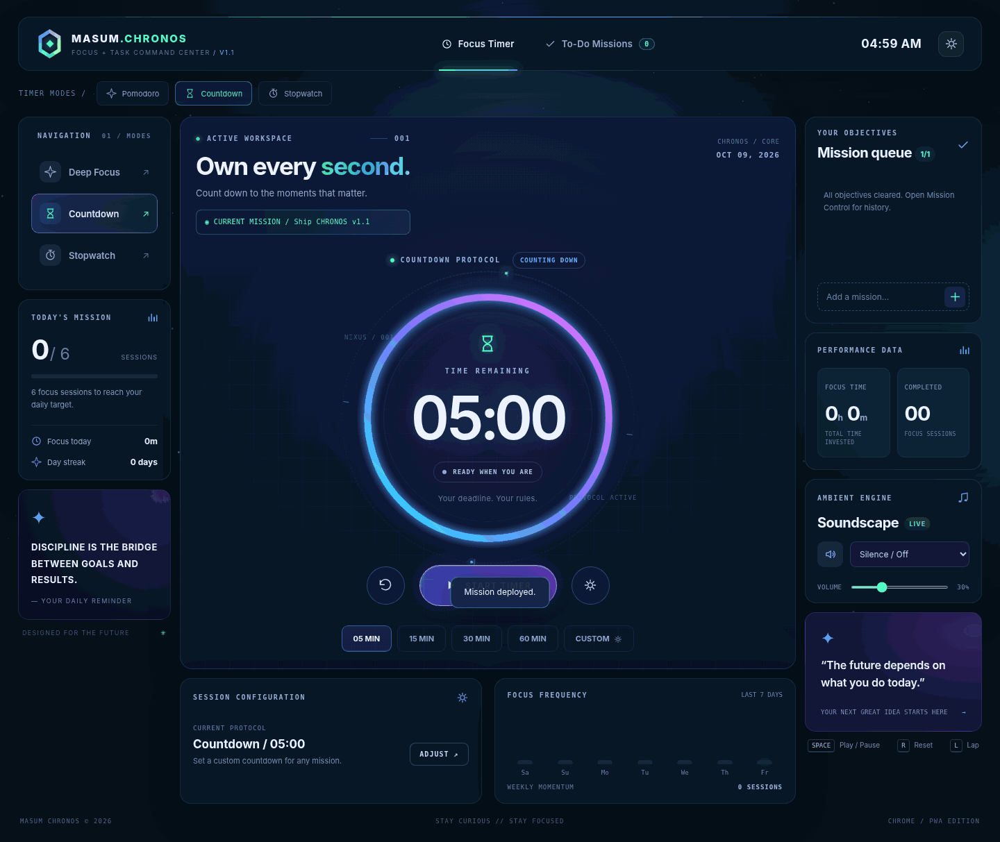
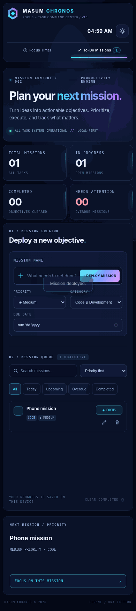

# MASUM CHRONOS // Timer + To-Do Mission Command Center



**v1.1.0 | Open-source futuristic productivity app by Masum Billah.**

One project, two workspaces: a **Focus Timer** (Pomodoro, Countdown, Stopwatch) and a full **To-Do Mission Command Center**, available both as a **Chrome-installable Progressive Web App** and a **VS Code extension**. No account, external APIs, paid services, or runtime dependencies.

## Mission Command Center (new in v1.1)

- Add, edit, delete, reopen and complete missions.
- Priorities: Low, Medium, High, Critical. Categories: Code, Study, Work, Personal.
- Optional due dates and overdue indicators.
- Search, smart filters (All / Today / Upcoming / Overdue / Completed), sorting (priority, due date, recent, oldest).
- Progress wheel, active/completed/overdue counters, next recommended mission.
- One-click **Focus on this mission** transfers the objective to the timer, keeping the existing timer settings.
- The small mission queue on the timer page uses the **same task data** as the full To-Do workspace.
- Local-first persistence; automatic migration of existing v1.0 task text/completion states, themes, timer settings, and stats.



## Focus Timer

- Pomodoro with configurable Focus / Short Break / Long Break, break frequency and optional auto-start.
- Countdown presets (5/15/30/60 min), custom durations, stopwatch laps.
- Animated orbital timer ring and star field, four themes: Nebula, Cyber, Aurora, Minimal.
- Focus session statistics, daily goal, weekly chart, streak, ambient synthesized soundscapes.
- `Space` start/pause, `R` reset, `L` stopwatch lap while on the timer page and not typing.
- Duration tracked by timestamps: background tab throttling won't change how much time elapsed.

## Install in Chrome / Windows (বাংলা)

1. Project ZIP extract করো, তারপর `masum-chronos` folder খোলো।
2. Python 3 থাকলে `start-chrome.bat` double-click করো। অথবা VS Code terminal-এ:

   ```powershell
   cd path\to\masum-chronos
   python -m http.server 5500 --directory web
   ```

3. Chrome-এ `http://localhost:5500` খোলো। App-এর **Focus Timer** অথবা **To-Do Missions** tab ব্যবহার করো।
4. Chrome-এর address bar install icon বা menu → **Install page as app** দিয়ে PWA install করতে পারো (menu wording Chrome version অনুযায়ী বদলাতে পারে)।
5. Browser tab বন্ধ করলে background notification নির্ভরযোগ্য থাকবে না; app আবার খুললে clock-based timer deadline reconcile হবে।

**No Python?** Open `web/index.html` in Chrome for basic local usage. PWA install, offline service worker and notifications need `localhost` or HTTPS.

## Install the VS Code extension

1. [Download the v1.1.0 VS Code extension](releases/masum-chronos-1.1.0.vsix) (`.vsix` file)।
2. VS Code → `Ctrl+Shift+P` → `Extensions: Install from VSIX...` → downloaded file select করো।
3. `Ctrl+Shift+P` → **CHRONOS: Open Focus Command Center**, অথবা bottom Status Bar-এর **Chronos**-এ click করো।

Terminal install:

```powershell
code --install-extension .\masum-chronos-1.1.0.vsix
```

To develop/debug the extension: open the repository in VS Code and press `F5`, then open the command in **Extension Development Host**.

Packaging alternatives:

```powershell
npm install -g @vscode/vsce
vsce package --no-dependencies
```

The included `tools/build_vsix.py` can generate a VSIX offline without npm.

## GitHub repository

**Repository:** https://github.com/gitwithmasum/Masum-Chronos

GitHub Pages publishes `web/` via the included `.github/workflows/pages.yml` workflow. The packaged VS Code installer is available under [`releases/masum-chronos-1.1.0.vsix`](releases/masum-chronos-1.1.0.vsix). Repository source changes trigger CI syntax, Webview, and extension-packaging checks. Releases uploaded to VS Code Marketplace must be published separately.

### GitHub Pages / Live Chrome app

The **web/** subfolder is the standalone browser app. GitHub Pages branch publishing expects files at the repo root or in `/docs`, not directly from arbitrary `/web`. Therefore this repository includes a ready-to-use **GitHub Actions Pages deployment workflow** for `web/`.

1. Repository **Settings → Pages → Build and deployment → Source: GitHub Actions** (if GitHub Pages is not enabled yet).
2. Commits to the `main` branch automatically trigger the workflow which publishes the contents of `web/`.
3. Once the deployment succeeds, visit `https://gitwithmasum.github.io/Masum-Chronos/`.

The live URL above is **expected**, not a claim that it is already deployed.

## Storage and privacy

- Chrome stores app state in the current site's browser localStorage; VS Code uses Webview state plus `globalState` to preserve the UI and its status timer.
- Existing v1.0 data at the **same origin** is automatically migrated to v1.1. Chrome `localhost` data and your new GitHub Pages site's storage belong to **different origins**, so they will not automatically share or migrate data.
- Chrome and VS Code task lists do **not** synchronize with each other. Cloud/cross-device sync is not included.
- No tracking scripts, CDNs, login, or remote APIs.
- Up to 300 stored missions per app profile; no push notification for to-do deadlines yet.

## Project structure

```text
masum-chronos/
├── .github/workflows/pages.yml  # GitHub Pages publishing
├── web/index.html               # Both workspaces, shared accessible markup
├── web/styles.css               # Responsive space-themed UI + animations
├── web/app.js                   # Timer + tasks + migration logic
├── web/sw.js                    # Offline PWA cache
├── web/manifest.webmanifest     # Chrome installable manifest
├── vscode/extension.js          # VS Code secure Webview + timer status
├── previews/                    # Real Chromium screenshots
├── tools/build_vsix.py          # Offline .vsix packer
├── tools/smoke_test.py          # Chromium functional smoke suite
├── start-chrome.bat             # Windows Chrome launcher
├── package.json                 # VS Code extension metadata
└── LICENSE                      # MIT
```

## Quality & security

- No inline interpolation of task titles into HTML; task content is rendered with `textContent`.
- VS Code Webview uses a strict Content Security Policy, local resources, and message validation.
- Functional UI smoke suite covers CRUD, filters, timer-to-task linking, theme, mobile overflow, data migration and existing stopwatch/countdown controls.
- Reduced-motion OS preference disables long-running decorative animations.
- Chrome/Windows behavior and full VSIX install must be confirmed on your device before public release. The smoke test uses a local HTML harness in headless Chromium because sandbox restrictions block actual localhost navigation in the build environment.

MIT License · © 2026 Masum Billah
